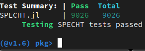
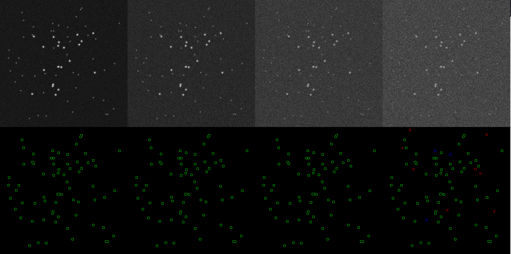
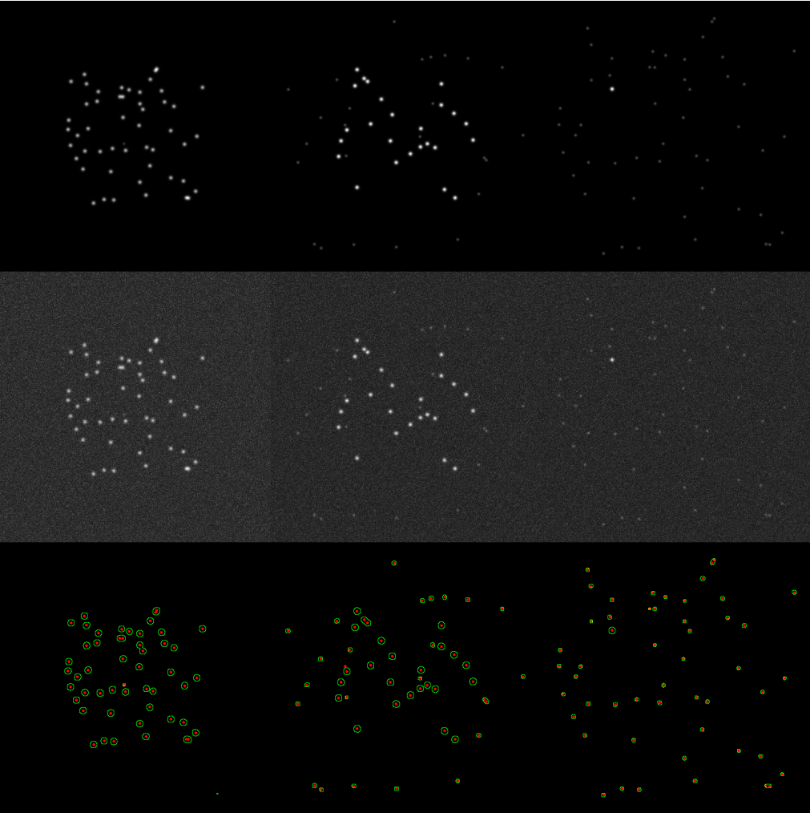
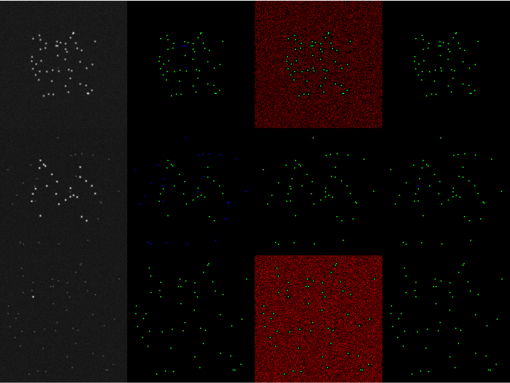
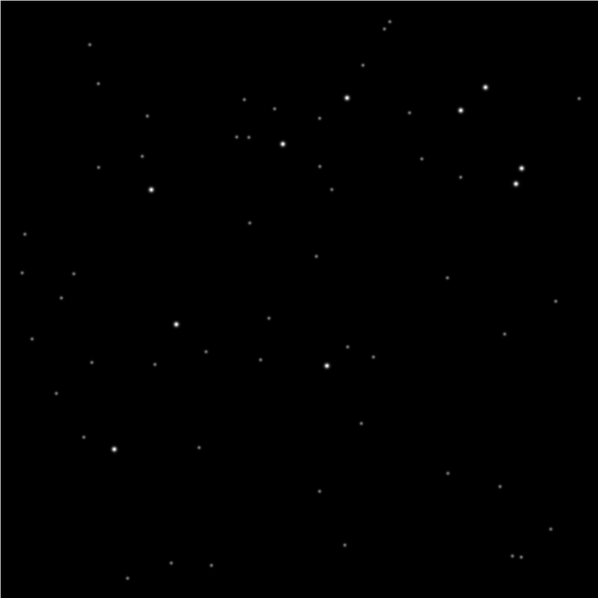
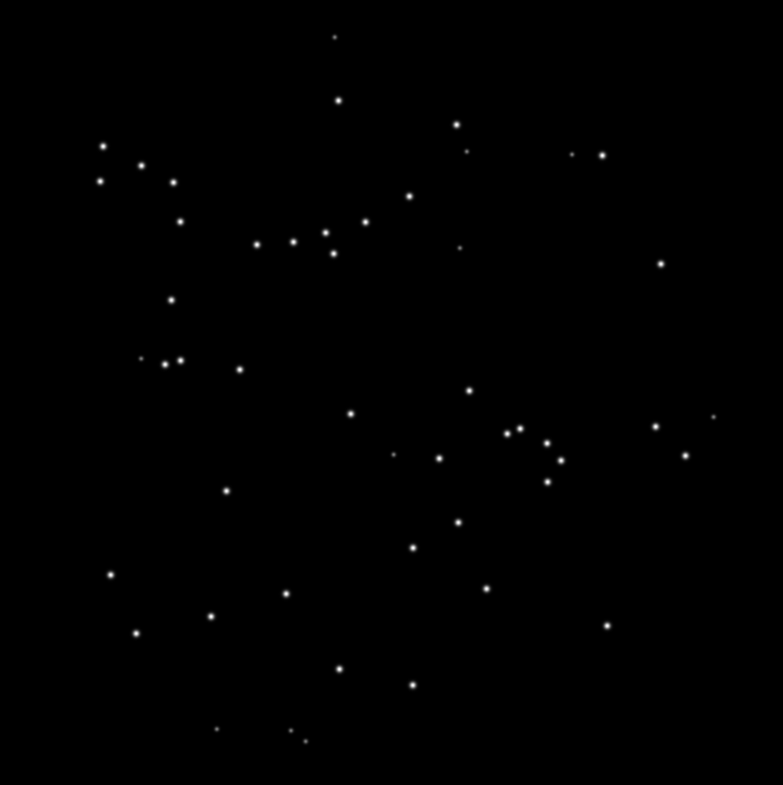
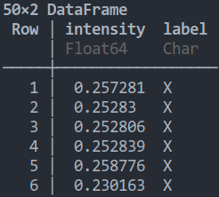

# SPECHT.jl

SPECHT is a Julia implementation of a contrastive weakly supervised object detection and identification method for fluorescence microscopy.

# Table of contents
1. [Introduction](#introduction)
2. [Installation](#install)
3. [Usage](#usage)
   1. [Object detection](#object)
   2. [Contrastive learning](#contrast)
3. [Notes](#notes)
4. [Multichannel spot detection for mitophagy.](#mitophagy)
5. [Datasets for reproduction.](#datasets)
6. [Reporting issues.](#issues)


<a name="introduction"></a>
## Introduction
Given 2 (or more) sets of images, each with a label, SPECHT detect objects adaptively & consistenly across datasets, and identifies how each object supports the image level label.

In the below example, we want to identify in images with label **'X'**, which objects are typical of label 'Y', and which exclusively of 'X'.


Illustrated with Y featuring mostly faint, small objects, and X a mixture of both large & bright, as well as faint and dim.

<a name="installation"></a>
### Installation
- Install Julia https://julialang.org/downloads/

##### Package only
```bash
julia
julia> ]   # The ']' keystroke activates the package manager, alternatively
# julia> using Pkg; Pkg.add("<githublink>")
(v1.x) pkg> add https://github.com/bencardoen/ERGO.jl
pkg> add https://github.com/bencardoen/SPECHT.jl
pkg> test SPECHT
```
If you prefer to isolate or install in an existing environment (not globally), the prefix the above with
```julia
>using Pkg; Pkg.activate(".")
```

##### Package + Parsing scripts
```bash
git clone https://github.com/bencardoen/SPECHT.jl
cd SPECHT.jl
julia
julia> ]
(v1.x) pkg> add https://github.com/bencardoen/ERGO.jl
pkg> add .  # Adds SPECHT from local disk
pkg> activate .
pkg> instantiate
pkg> test SPECHT
```

If, and only if, the tests succeed, continue to usage. Else, please report an issue with reproducible error.
Note that it's fine if you see **errors or warnings** scroll by, they're expected so I know certain functions will warn on use. As long as all tests pass, usage is safe.

You should see something like this



<a name="usage"></a>
## Usage


In the below sections we'll walk through a few of these use cases with code examples.
For the full API:
```julia
using SPECHT
SPECHT.<tab> # autocompletes all exported functins
?SPECHT.process_tiffimage  # ?X invokes the documentation of X
```

To visualize images, please install ImageView
```julia
julia>using Pkg; Pkg.add("ImageView")
```

ImageView is not a hard dependency of SPECHT, adding it means it can't run without desktop dependencies, e.g. it breaks on HPC clusters.

<a name="object"></a>
### Object detection illustrated on (noisy) in silico images.
Let's create fuzzy objects in an in silico (simulated) image.
```julia
using SPECHT, ImageView, Images
X, Y = 512, 512
σ = 3
## This takes ~ 30s, decrease the image size for faster results.
ground, total = SPECHT.generate_scenario(X, Y, 20, 50, σ=σ)[1:2]
## Ground is a binary mask of the locations (centroids) of objects, total is the in silico image.
# Display image and GT
imshow(mosaicview([ground, total]))
```
Left are the locations of the randomly placed objects, right the generated in silico image.


#### Effect of decreasing SNR on object detection stage
Let's evaluate decreasing SNR by adding stronger Gaussian and Poisson noise.
```julia
### Noise parameters, Gaussian and Poisson (x / 255)
using SPECHT, ERGO, Images, ImageView
X, Y, σ = 512, 512, 3
facs = [16, 32, 64, 96]
## Reuses the 'total' image from previous snippet
results  = Dict()
for NSFAC in facs
	@info "Noise factor $(NSFAC/255)"
	gns = SPECHT.gaussiannoise(zeros(X, Y), NSFAC)
	pns = SPECHT.poissonnoise(zeros(X, Y), NSFAC)
	totalnoise = gns .+ pns
	noisedimage = ERGO.normimg(totalnoise .+ total)
	ccs = SPECHT.process_tiffimage(noisedimage, 0.4, [σ,σ], true, 2, 0)[1];
	cmsk = filtercomponents_using_maxima_IQR(noisedimage, ERGO.tomask(ccs))
	out = maskoutline(ERGO.tomask(ccs));
	results[NSFAC] = ccs, out, noisedimage, cmsk
end
connected_components, outline_objects, noisy_image, binarymask = results[32]
imshow(SPECHT.tcolors([binarymask, total, outline_objects]))
```


#### SPECHT compared to other classical object detection methods.
The aim of SPECHT is to be robust, adaptive, and **consistent** across images, channels, and datasets. Because the detected objects are passed down to the labelling stage, where their features and frequencies determine the contrastive labels, we absolutely need consistent performance, even if that means suboptimal performance on some images.

```julia
# Utility functions
function comp(ot)
	return SPECHT.tcolors([GFM, ♌(ot)])
end
function cmpt(ot, GFM)
	return SPECHT.tcolors([GFM, ot])
end
## Simulation
X, Y, σ, NSFAC = 512, 512, 3, 32
res = Dict()
SZ = [1, 25, 50]
for (i, s) in  enumerate(SZ)
	ground, total, _, _ = generate_scenario(X, Y, SZ[end-i+1], SZ[i], σ=σ, dimfactor=6)
	totalnoise = SPECHT.gaussiannoise(zeros(X, Y), NSFAC) .+ SPECHT.poissonnoise(zeros(X, Y), NSFAC)
	noisedimage = ERGO.normimg(totalnoise .+ total)
	ccs = SPECHT.process_tiffimage(noisedimage, 0.4, [σ,σ], true, 2, 0)[1];
	cmsk = filtercomponents_using_maxima_IQR(noisedimage, ERGO.tomask(ccs))
	out = maskoutline(ERGO.tomask(ccs));
	GF = ImageFiltering.imfilter(ground, KernelFactors.gaussian([σ/4,σ/4]))
	GFM = ERGO.tomask(N0f8.(GF))
	res[s] = ground, total, noisedimage, cmsk, out, GFM
end

Ss = [res[k][2] for k in sort(keys(res)|>collect)]
Rs = [res[k][3] for k in sort(keys(res)|>collect)]
Qs = [cmpt(res[k][end-1], res[k][end]) for k in sort(keys(res)|>collect)]
imshow(mosaic(Ss..., Rs..., Qs..., nrow=3, rowmajor=true))
```



```julia

X, Y = 512, 512
σ = 3
res = Dict()
NSFAC=16 # 32
SZ = [1, 25, 50]
for (i, s) in  enumerate(SZ)
	ground, total, _, _ = generate_scenario(X, Y, SZ[end-i+1], SZ[i], σ=σ, dimfactor=6)
	totalnoise = SPECHT.gaussiannoise(zeros(X, Y), NSFAC) .+ SPECHT.poissonnoise(zeros(X, Y), NSFAC)
	noisedimage = ERGO.normimg(totalnoise .+ total)
	ccs = SPECHT.process_tiffimage(noisedimage, 0.4, [σ,σ], true, 2, 0)[1];
	cmsk = filtercomponents_using_maxima_IQR(noisedimage, ERGO.tomask(ccs))
	out = maskoutline(ERGO.tomask(ccs));
	GF = ImageFiltering.imfilter(ground, KernelFactors.gaussian([σ/4,σ/4]))
	GFM = ERGO.tomask(N0f8.(GF))
	res[s] = ground, total, noisedimage, cmsk, out, GFM
end

## Show that 1 setting works equally well for different conditions
Ss = [res[k][2] for k in sort(keys(res)|>collect)]
Rs = [res[k][3] for k in sort(keys(res)|>collect)]
Qs = [cmpt(res[k][end-1], res[k][end]) for k in sort(keys(res)|>collect)]
imshow(mosaic(Ss..., Rs..., Qs..., nrow=3, rowmajor=true))


orderedkeys = d -> sort(keys(d)|>collect)
MS = []
SCUZZIES = []
for k in orderedkeys(res)
	I = res[k][3]
	GFM = res[k][end]
	mine = res[k][end-1]
	minem = res[k][end-2]
	gt = res[k][1]
	logu, logu_out = computelogotsu(I)
	ots, ots_out = computeotsu(I)
	M = [I, cmpt(logu_out, GFM), cmpt(ots_out, GFM), cmpt(mine, GFM)]
	fp, tp, fn = score_masks_visual(GFM, minem)
	otfp, ottp, otfn = score_masks_visual(GFM, ots)
	lfp, ltp, lfn = score_masks_visual(GFM, logu)
	push!(MS, M)
	push!(SCUZZIES, [I, SPECHT.tcolors([lfp , ltp, lfn]), SPECHT.tcolors([otfp , ottp, otfn]), SPECHT.tcolors([fp , tp, fn])])
end
imshow(mosaic(MS[1]...,MS[2]...,MS[3]..., nrow=3, rowmajor=true))

imshow(mosaic(SCUZZIES[1]..., SCUZZIES[2]..., SCUZZIES[3]..., nrow=3, rowmajor=true))

```



<a name="contrast"></a>
### Contrastive learning

Similar to Multiple Instance Learning, or mixture decomposition (splitting a distribution), SPECHT learns to identify, for each detected object, how likely it is to be associated with the image level label.
Unlike MIL, each image (bag) can contain 'positive' and 'negative' examples, and unlike mixture problems the distribution does not need to have clearly separated modes.

For each object i in an image I, SPECHT learns how likely it is that i ∈ I, and given other images (with a different label J), P[i ∈	J].

You'd use this in problems where there is no crisp split (common in biology), or when objects transition (e.g. grow/shrink, transform), so you can measure where an object is on a scale or trajectory.

We'll show a quick example to clarify.

Let's have 2 images, one with mostly dim (Y), one with a mix of bright and dim (X).

Find for each x ∈ X, P[x->X] > P[x->Y] ?

##### Image Y: Mostly dim objects


##### Image X: A mix of bright and dim objects


#### Image X annotated by SPECHT
We superimpose Specht's label onto image X.
Each object **o** is color coded with green and red:
- green [0-1] : **o** is typical of image X
- red [0-1] : **o** is typical of image Y

The small, faint objects are identified as typical of Y (red), the larger bright ones as typical of X. In between cases where there's no clear distinction go to orange.

The below code shows how to obtain the in silico data, and the resulting output.


```julia
using Images, ImageView, Distributions, SPECHT, ERGO, ImageFiltering, Random, Logging, Statistics

### Generate 2 images, one with mostly dim, one with dim and bright
X, Y = 1024, 1024
σ = 4
bright, dims = [40, 10], [10, 50]

images = [SPECHT.generate_scenario(X, Y, bright[i], dims[i], σ=σ, dimfactor=4)[2] for i in 1:2]

images[1] .*= 0.75

## Detect objects with maximal recall
detected = []
for im in images
	cc = SPECHT.process_tiffimage(im, 0.2, [σ,σ], true, 20, 0)[1];
	cm = filtercomponents_using_maxima_IQR(im, ERGO.tomask(cc))
	push!(detected, cm)
end

# Connected Components
components = [Images.label_components(ci, trues(3,3)) for ci in detected]

function getfeatures(imgs, ccs)
	N = maximum(ccs)
	F = zeros(N, 3)
	ls = Images.component_lengths(ccs)[2:end]
	si = Images.component_indices(ccs)[2:end]
	F[:,1] .= ls
	for i in 1:N
		nt = imgs[si[i]]
		F[i,2] = mean(nt)
		F[i,3] = std(nt)
	end
	return F
end

Fx, Fy = [getfeatures(im, ci) for (im, ci) in zip(images, components)]


## Compute contrastive label
## For each x ∈ X, how likely is it to appear in Y ?
px_to_y = contrast_x_to_y(Fx[:,2:2], Fy[:,2:2])
## For each x ∈ X, how likely is it to appear in X ?
px_to_x = contrast_x_to_y(Fx[:,2:2], Fx[:,2:2])

function label_image(cx, px)
	res = Images.N0f16.(ERGO.aszero(cx))
	indices = Images.component_indices(cx)[2:end]
	for (j, ind) in enumerate(indices)
		res[ind] .= px[j]
	end
	res
end
cx = components[1]
r, g = label_image(cx, p) for p in [px_to_y, px_to_x]


# Show the labelled image
imshow(SPECHT.tcolors([r, g]))

```

#### Contrastive learning with a CSV/DataFrame
If you already have objects with features, you can skip the object detection stage, load a csv and run the annotation code.
For example, let's say you have a dataframe like the below



```julia
## Resuming from the previous example.
Fx, Fy = [getfeatures(im, ci) for (im, ci) in zip(images, components)]
### Save to CSV (skip if you have your own, shown here for demo)
using DataFrames, CSV
labels = ["X", "Y"]
dfx, dfy = [DataFrame(intensity = fx[:, 2:2][:], label=l) for (fx, l) in zip([Fx, Fy], labels)]
dataframe = vcat([dfx, dfy]...)
CSV.write("test.csv", dataframe)

### Load (replace with your csv data)
dataframe_read = CSV.read("test.csv", DataFrame)
## Select based on column label
xs, ys = [dataframe_read[dataframe_read[!,:label].==l, :] for l in ["X", "Y"]]
xi, yi = xs[!,:intensity], ys[!,:intensity]
expand = x -> reshape(x, size(x)..., 1) # Need a N,k, not a N, array as input
px_to_y = contrast_x_to_y(expand(xi), expand(yi))

```


<a name="notes"></a>
### Notes

- Infrequent objects
If you have outliers, heavy tails, or infrequent objects in both, please use the log-odds ratio to discriminate:
```julia
# Log(p/q) = log(p) - log(q)
lp_x_y = log(px_y) - log(py_x)
```
This compensates for relative frequency.
- Large dimensional data : Unless your dimensions (features) are all informative, the curse of dimensionality will make it hard to differentiate objects.
- Correlated features : Because SPECHT uses the Mahalanobis distance in the background, the effect of correlated features will be mitigated (up to a point)
- Be aware of (Simpson's paradox)[https://plato.stanford.edu/entries/paradox-simpson/]: if you have 10 images with label A, and 5 with label B, you need to either use bootstrapping per image, or use the cell id variable to exclude confounding effects. (this is not specific to SPECHT, but holds in general)

Dimensionality reduction, preprocessing, denoising, and bootstrappng are techniques that can help resolve the above isses.

<a name="mitophagy"></a>
### Multichannel spot detection for mitophagy.
```
julia --project=. src/spots_master_script.jl -z 0.5 -Z 3.5 -s 0.1 -i $INPUTDIR -o $OUTPUTDIR -f k
```
The "--project=." executes in the cloned repository, see Installation.

Where INPUTDIR is organized in the following way
- root
  - replicatenr (integer)
    - experiment1
    - experiment2
      - 'Cropped'
        - Series_x (where x is an integer)
        - Series_y
          - cellnumber (integer)
            - somename_ch00.tif (Mitochondria)
            - somename_ch01.tif (C1 - RFP)
            - somename_ch02.tif (C2 - GFP)

You can omit the mitochondria channel, not the others.
Replicate, experimentx, Series and cellnr are used in the generation of CSV tables.
If you don't follow the structure, images will not be processed.

##### Arguments
```
-z,Z,s : run parameter sweep : z:s:Z, e.g. 0.5:0.1:0.7 would test z = [0.5, 0.6, 0.7]
-i : path to data
-o : path where to save output
-f k: filter (drop) spots <= k*k pixels, e.g. X and Y should be > k
```
##### Generated output
- root
  - csvsfiles
    - experimentnamecounts_z_replicate_x.csv :
      - CSV with counts per cell of spots in channel 1, 2, 3. C12: 1&2 overlapping, 1M : 1&3 overlapping, etc
    - experimentnamespots_z_replicate_x.csv :
      - CSV with headers : celln	serie	experiment	channel	area	z	replicate	distancec1c2mito, the last column describes distance of C1/C2 overlapping spots to C3
  - replicate_x_zvalue
    - experimentname_serie_a_celln_b_channel_{0,1,2}_mask.tif : spots for channels
    - experimentname_serie_a_celln_b_channel_{0,1,2}_mask_filtered.tif : spots for channels filtered for spots <= k*k
    - various combinations


### Similar projects and software of use

- [Julia Images's Segmentation library](https://juliaimages.org/latest/pkgs/segmentation/)
- [CellProfiler](https://genomebiology.biomedcentral.com/articles/10.1186/gb-2006-7-10-r100)
- [ImageJ|FiJi](https://imagej.net/software/)


### Cite
If you find this repository of use, please cite
```
@article{cardoen2020specht,
  title={SPECHT: Self-tuning Plausibility Based Object Detection Enables Quantification of Conflict in Heterogeneous Multi-scale Microscopy},
  author={Cardoen, Ben and Wong, Timothy and Alan, Parsa and Lee, Sieun and Matsubara, Joanne Aiko and Nabi, Ivan Robert and Hamarneh, Ghassan},
  year={2020},
  publisher={TechRxiv}
}
```

<a name="datasets"></a>
### Reproducibility section
#### Data
Datasets for the paper (including output) can be found [here](https://vault.sfu.ca/index.php/s/g71iRPTU1VZIRzO).
Note that the data is licensed (with original providers' reserved rights superceding this license) under [CC BY 4.0](https://creativecommons.org/licenses/by/4.0/)
If you wish to re-use the data, please contact us.

##### Checksum

The datasets.zip should have an SHA256 checksum of
```
5cab369b72ddea6cf17c315303d87213fbc12768f378bbc5184af0ee76e866ff
```

Verify by
```bash
sha256sum datasets.zip
```

#### Code
The scripts matching the processing for the paper can be found in ./src/scripts.
Note that each can have extra dependencies that are not necessary for SPECHT, but useful for e.g. visualization.

You can install any missing packages by

```julia
using Pkg; Pkg.install("<missingpackage>")
```

<a name="issues"></a>
### Issues/Troubleshooting
If you have any issue or recommendation using SPECHT, please create an issue, following the below guidelines:

- List exact, minimal steps to reproduce the issue.
- Expected output vs actual output.
